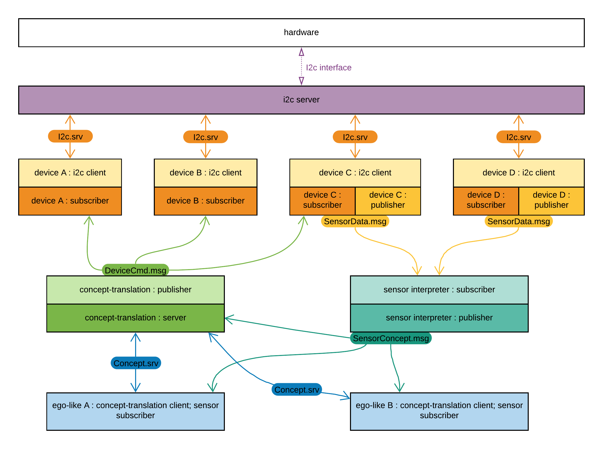

# zakharos_core
Software core (ROS-based) for the Zakhar project

- Part of the [Zakhar's Brain](https://github.com/an-dr/zakhar_brain)
- Part of the [Zakhar Project](https://github.com/an-dr/zakhar)

## Packages
The repository is represented by ROS-packages:

- [zakhar](src/zakhar_common) - main package to controll Zakhar
- [zakhar_common](src/zakhar_common) - facilities used by all packages
- [zakhar_i2c](src/zakhar_i2c) - Zakhar's ROS I2C server
- [zakhar_i2c_devices](src/zakhar_i2c_devices) - nodes representing parts of the robot
- [zakhar_i2c_mind](src/zakhar_i2c_mind) - nodes execitung high level processes
- [zakhar_i2c_msgs](src/zakhar_i2c_msgs) - ros communication descriptors

Some of the packages contain ROS-nodes. Each node is a program that operates through `roscore` - main node of ROS

## Nodes

Interaction and data flows are shown at the picture:



Why Zakhar uses this specific architecture you can read in the article:
[Robot with the Conscious: Imitating animal behavior for reducing user’s anxiety – technical_](https://blog.agramakov.me/2020/05/29/robot-with-the-conscious/)

## How to run

### Build

1. Clone the repository into your home folder:
```bash
cd ~
git clone https://github.com/an-dr/zakharos_core.git
```

2. Build
```bash
bash ./zk_build.sh
```

### Run

1. If the build was successfull you have a file for setting up environment:
```bash
source ./devel/setup.sh
```

2. Start roscore if it is not:
```bash
roscore
```

3. Run
```bash
rosrun zakhar launch.py -n all
```

Done!