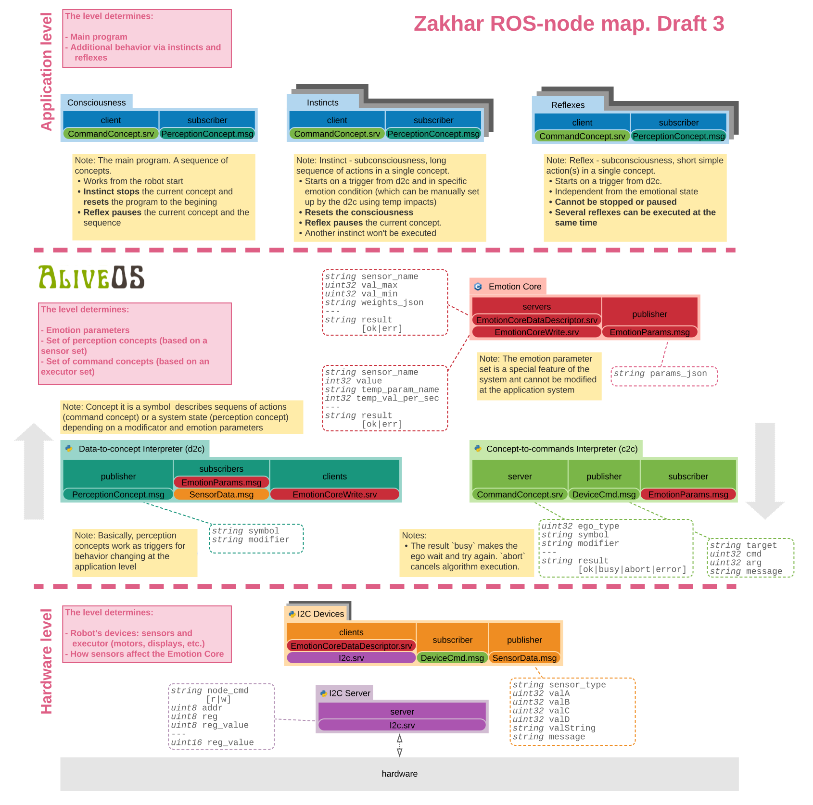

# zakharos_core

Software core (ROS-based) for the Zakhar project

- Part of the [Zakhar's Brain](https://github.com/an-dr/zakhar_brain)
- Part of the [Zakhar Project](https://github.com/an-dr/zakhar)

## Packages

The repository is represented by ROS-packages:

- [zakhar_common](src/zakhar_common) - facilities used by all packages
- [zakhar_i2c](src/zakhar_i2c) - Zakhar's ROS I2C server and an abstract I2C device class
- [zakhar_i2c_devices](src/zakhar_i2c_devices) - nodes representing parts of the robot
- [zakhar_interpreters](src/zakhar_interpreters) - convert data to concepts understandable to ego-like nodes and vice versa
- [zakhar_launch](src/zakhar_launch) - robot launching configurations
- [zakhar_i2c_mind](src/zakhar_i2c_mind) - nodes executing high level processes
- [zakhar_i2c_mind_tests](src/zakhar_i2c_mind) - used for development purposes
- [zakhar_i2c_msgs](src/zakhar_i2c_msgs) - ROS communication descriptors

Some of the packages contain ROS-nodes. Each node is a program that operates through `roscore` - main node of ROS

## Nodes

Interaction and data flows are shown at the picture:



Why Zakhar uses this specific architecture you can read in the article:
[Robot with the Conscious: Imitating animal behavior for reducing user’s anxiety – technical_](https://blog.agramakov.me/2020/05/29/robot-with-the-conscious/)

## How to run

You need:

- Raspberry Pi (>=2Gb)
- ROS noetic installed
- Python >= 3.6
- zakhar_pycore package (`pip install zakhar_pycore`)

### Build

1. Clone the repository into your home folder:

```bash
cd ~
git clone https://github.com/an-dr/zakharos_core.git
```

2. Build

```bash
bash ./build.sh
```

### Run

1. If the build was successful you have to source the environment (can be placed into `.bashrc`):

```bash
source ./source_env.sh
```

2. Start any defined configuration from the `zakhar_launch` package, e.g.:

```bash
roslaunch zakhar_launch demo_reptile.launch
```

Done!